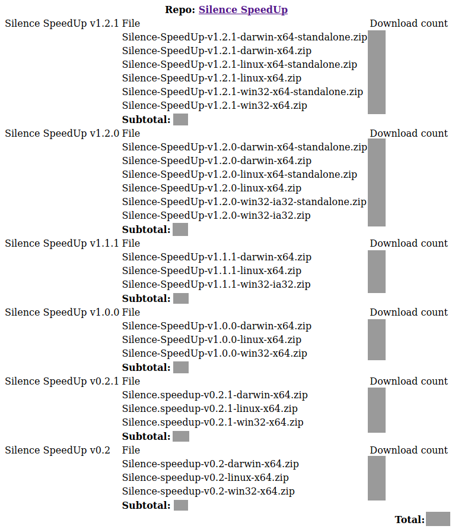

# Track my repo stats
Keep track of my github repos release stats daily (useful for assets only).

Example (tracking [Silence SpeedUp](https://github.com/padvincenzo/silence-speedup)):



## Get started

1. Create the database (copy/paste code from ``database.sql`` into phpmyadmin)
2. Insert your repo names (the ones you want to track)

```sql
insert into project (name, slug) values
("My repo name", "my-repo-short");
```

3. Open ``repo-stats.php``
4. Update database credentials with yours

```php
// Database credentials
$host = "localhost";
$user = "root";
$password = "your-db-password";
$database = "your-db-name";
```

5. Update github username

```php
// Github username
$username = "mygithubusername";
```

6. Choose a password

```php
// Choose a password (empty string = no password)
$password = "123prova";
```

7. Set your user-agent. To get yours, run this php script from your browser:

```php
<?php
echo $_SERVER['HTTP_USER_AGENT'];
?>
```

8. Save edited ``repo-stats.php`` to your server
9. Once a day open ``<your-server-ip>/repo-stats.php?code=<your-password>&update=true`` to keep your database updated

## Chek differences between two dates
Open phpmyadmin and run these queries. Note that assets that not increased their download count will not be displayed.

- today and first day of tracking

```sql
SELECT a.tag, a.filename, MIN(d.log_date) "previously", MIN(d.dl_count) "were", MAX(d.log_date) "now", MAX(d.dl_count) "are"
FROM project_downloads d INNER JOIN project_asset a
ON d.idasset = a.idasset
GROUP BY d.idasset
HAVING MAX(d.dl_count) - MIN(d.dl_count) > 0
ORDER BY a.tag, MAX(d.dl_count) - MIN(d.dl_count);
```

- today and ``<NUMBER>`` days ago (replace ``<NUMBER>`` with the desired one)

```sql
SELECT a.tag, a.filename, MIN(d.log_date) "previously", MIN(d.dl_count) "were", MAX(d.log_date) "now", MAX(d.dl_count) "are"
FROM project_downloads d INNER JOIN project_asset a
ON d.idasset = a.idasset
WHERE d.log_date in (CURDATE(), DATE_SUB(CURDATE(), interval NUMBER day))
GROUP BY d.idasset
HAVING MAX(d.dl_count) - MIN(d.dl_count) > 0
ORDER BY a.tag, MAX(d.dl_count) - MIN(d.dl_count);
```

## Last week report

```sql
SELECT a.filename AS 'asset',
  d7.dl_count AS '7 days ago',
  d6.dl_count AS '6 days ago',
  d5.dl_count AS '5 days ago',
  d4.dl_count AS '4 days ago',
  d3.dl_count AS '3 days ago',
  d2.dl_count AS '2 days ago',
  d1.dl_count AS '1 day ago'
FROM project_asset a,
  (SELECT * FROM project_downloads WHERE log_date = DATE_SUB(CURDATE(), INTERVAL 1 day))d1,
  (SELECT * FROM project_downloads WHERE log_date = DATE_SUB(CURDATE(), INTERVAL 2 day))d2,
  (SELECT * FROM project_downloads WHERE log_date = DATE_SUB(CURDATE(), INTERVAL 3 day))d3,
  (SELECT * FROM project_downloads WHERE log_date = DATE_SUB(CURDATE(), INTERVAL 4 day))d4,
  (SELECT * FROM project_downloads WHERE log_date = DATE_SUB(CURDATE(), INTERVAL 5 day))d5,
  (SELECT * FROM project_downloads WHERE log_date = DATE_SUB(CURDATE(), INTERVAL 6 day))d6,
  (SELECT * FROM project_downloads WHERE log_date = DATE_SUB(CURDATE(), INTERVAL 7 day))d7
WHERE d1.idasset = a.idasset
  AND d2.idasset = a.idasset
  AND d3.idasset = a.idasset
  AND d4.idasset = a.idasset
  AND d5.idasset = a.idasset
  AND d6.idasset = a.idasset
  AND d7.idasset = a.idasset
```

